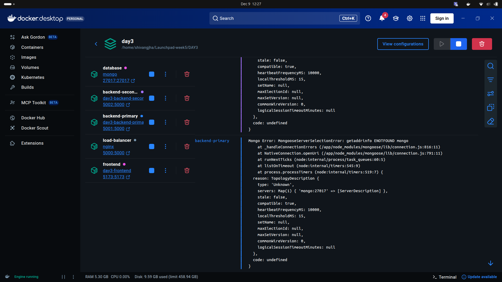

# Running Multiple Backend Instances with an NGINX Reverse Proxy (Load Balancer)

A concise guide showing how two Node.js backend instances were load-balanced using an NGINX container via Docker Compose.

---

## 1. Objective
- Run two instances of the same Node.js backend
- Load balance traffic between them using NGINX

---

## 2. Folder structure
```
project-root/
├── server/              # backend code
├── client/              # frontend
├── nginx/
│   └── nginx.conf       # reverse proxy config
└── docker-compose.yml   # multi-service setup
```

---

## 3. Docker Compose architecture (summary)
- backend-primary
    - built from `./server`
    - container port `5000`, host port `5001`
- backend-secondary
    - built from `./server`
    - container port `5000`, host port `5002`
- load-balancer (NGINX)
    - official `nginx` image
    - mounts `./nginx/nginx.conf`
    - exposes host port `5000`
    - proxy_pass to both backends (round-robin)
- database
    - MongoDB standard container
- frontend
    - served separately (included in compose)

---

## 4. NGINX load-balancer (essentials)
`nginx.conf`:
```events {}
http {
    upstream backend_cluster {
        server backend-primary:5000;
        server backend-secondary:5000;
    }
    server {
        listen 5000;

        location /api/ {
            proxy_pass http://backend_cluster;
        }
    }
}
```

Mount this file as:
```yaml
services:
    load-balancer:
        image: nginx:latest
        ports:
            - "5000:5000"
        volumes:
            - ./nginx/nginx.conf:/etc/nginx/nginx.conf:ro
```

---

## 5. Steps followed
1. Duplicate backend service in `docker-compose.yml` as `backend-primary` and `backend-secondary`, both building from `./server` and exposing different host ports.
2. Create `nginx/nginx.conf` with an `upstream` block listing both backends and a `server` block proxying `/api`.
3. Mount `nginx.conf` into the NGINX container (read-only).
4. Start the stack:
```bash
docker compose up -d --build
```

This builds and starts: `backend-primary`, `backend-secondary`, `load-balancer`, `database`, and `frontend`.

---

## 6. Verification (Docker Desktop)
- Open Docker Desktop → select your Compose project
    - Confirm containers running: `backend-primary`, `backend-secondary`, `load-balancer`, `database`, `frontend`
- Inspect `load-balancer` logs
    - Ensure NGINX resolved `backend-primary:5000` and `backend-secondary:5000` (no "host not found" errors)
- Test round-robin behavior
    - Visit: `http://localhost:5000/api`
    - Refresh multiple times should alternate responses, e.g.:
        - "Response from backend-primary"
        - "Response from backend-secondary"
---

# Screenshots 

