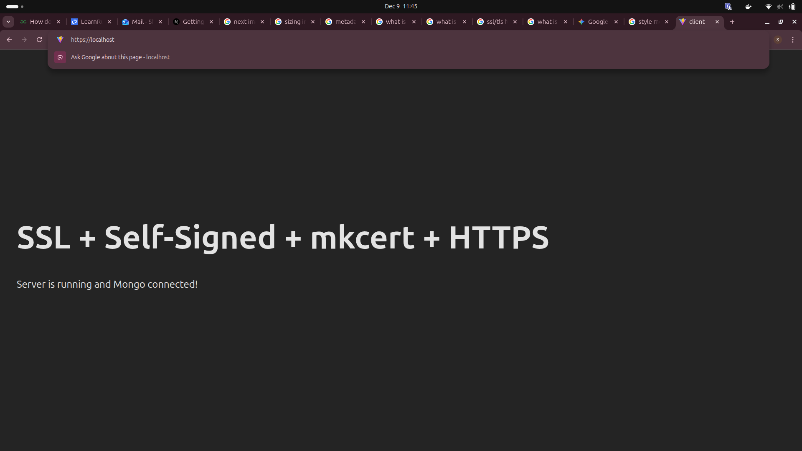
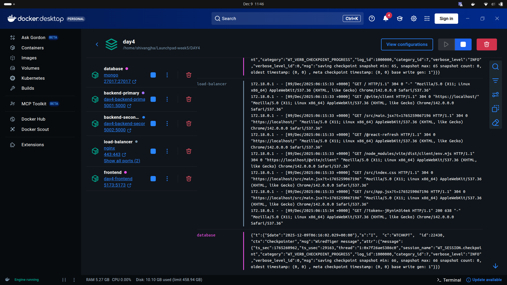
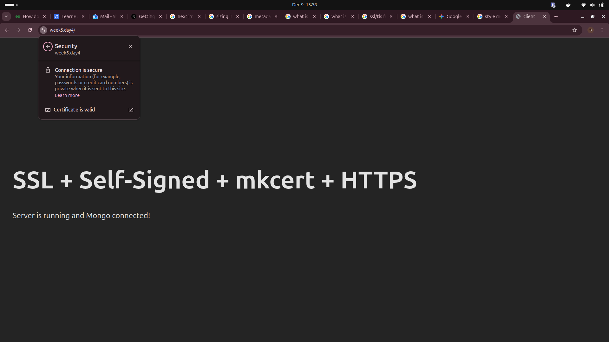

# HTTPS + SSL Setup

## 1 Install mkcert (local CA) — one-time
Install dependencies and register a local CA:

```sh
sudo apt install mkcert libnss3-tools
mkcert -install
```

## 2 Generate certificates
From your project's `nginx/certs/` directory:

```sh
cd nginx/certs
mkcert localhost
```

This produces:
- `localhost.pem`
- `localhost-key.pem`

These files will be mounted into the NGINX container.

# 3. NGINX HTTPS Termination
NGINX responsibilities:
- Terminates HTTPS (reads certs and decrypts traffic)
- Redirects HTTP → HTTPS (redirects requests on port 5000 to 443)
- Distributes traffic to backends (round-robin using an `upstream` group)

Backends continue to run on HTTP internally (e.g., port 5000).

# 4. Steps to Run the Entire Setup

1. Place certs in `nginx/certs/`
    - `localhost.pem`
    - `localhost-key.pem`
2. Keep `nginx.conf` inside `nginx/` and ensure it contains:
    - `upstream` backend cluster
    - HTTP → HTTPS redirect
    - SSL configuration (paths to cert + key)
    - Proxy rules to backend nodes
3. Run Docker Compose:

```sh
docker compose up -d --build
```

This rebuilds images and starts containers with latest changes.

4. Verify running services:

```sh
docker ps
```

Expected services:
- `mongo`
- `backend-primary`
- `backend-secondary`
- `load-balancer`
- `frontend`

# 5. How to Test

## 6 Frontend
Open in browser:
```
https://localhost
```
If Vite blocks host, add `localhost` and `frontend` to `allowedHosts`.

## 7 Load Balancer
Check API endpoint:
```
https://localhost/api
```
Responses should alternate between `backend-primary` and `backend-secondary` (round-robin).

## 8 Adding local domain
1. open host files 
    sudo nano /etc/hosts
2. Add the line
    127.0.0.1 <local_domain_name>
3. Generate new certificates again for local_domain_name and add them in your project
4. update the ngnix.conf and build the containers again
5. You can now see your project through the https://<loacl-domain_name>

# Screenshots




