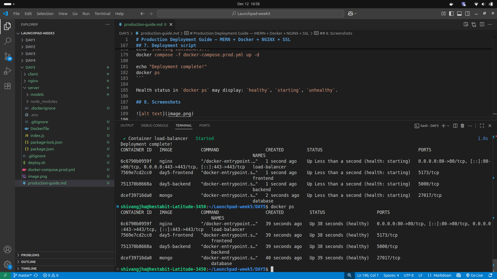
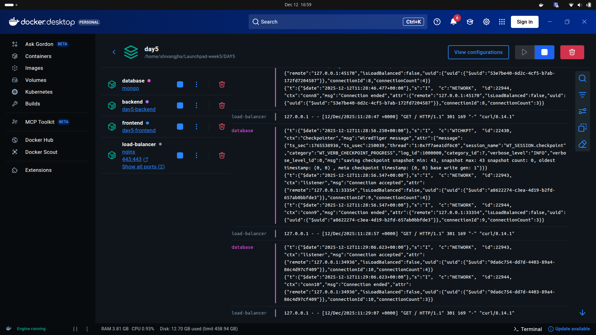
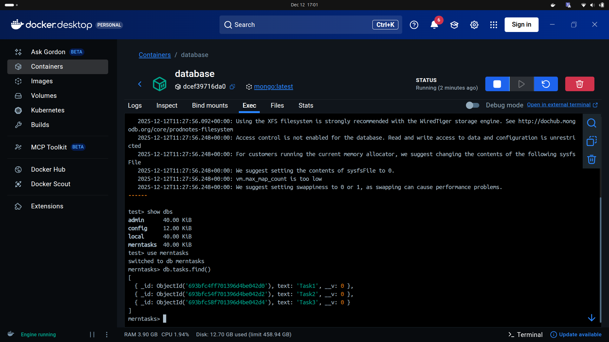
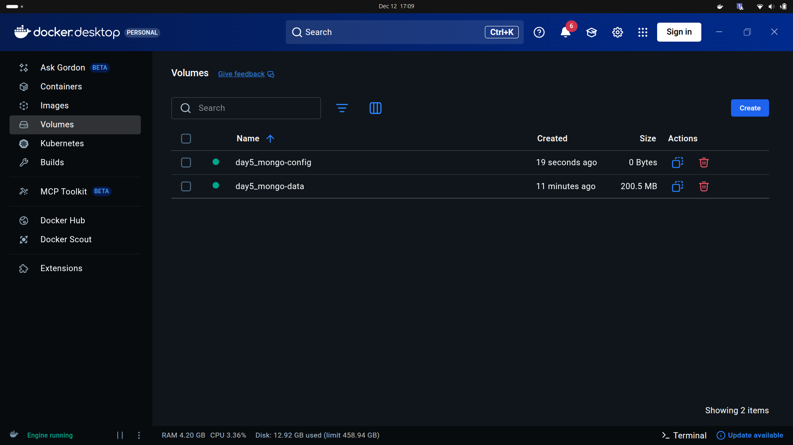

# Production Deployment Guide — MERN + Docker + NGINX + SSL

A concise, production-ready guide to deploy a MERN application with Docker, NGINX (reverse proxy + TLS), health checks, and an optional load balancer.

---

## 1. Project structure

```
.
├── client/              # React (Vite) frontend
│   ├── Dockerfile
│   └── .env
├── server/              # Node.js backend
│   ├── Dockerfile
│   └── .env
├── nginx/
│   ├── nginx.conf
│   └── certs/
│       ├── <local_domain_name>.pem
│       └── <local_domain_name>-key.pem
├── docker-compose.prod.yml
└── deploy.sh
```

---

## 2. Environment variables

client/.env
```env
VITE_API_URL=<https-production-api-url>
```

server/.env
```env
PORT=<backend-port>
MONGO_URI=<mongodb-connection-string>

```

---

## 3. Production Dockerfiles

server/Dockerfile
```dockerfile
FROM node:<version>
WORKDIR /app
COPY package*.json .
RUN npm ci
COPY . .
EXPOSE <backend_port>
CMD ["npm", "start"]
```

client/Dockerfile
```dockerfile
FROM node:<version>
WORKDIR /app
COPY package*.json ./
RUN npm install
COPY . .
EXPOSE <frontend_port>
CMD ["npm", "run", "dev", "--", "--host"]
```

---

## 4. NGINX reverse proxy

nginx/nginx.conf
```nginx
events {}
http {
    upstream backend_cluster {
        server backend:<backend_port>;
    }
    server {
        listen 80;
        server_name <local_domain_name>;
        return 301 https://$host$request_uri;
    }
    server {
        listen 443 ssl;
        server_name <local_domain_name>;
        ssl_certificate     /etc/nginx/certs/<local_domain_name>.pem;
        ssl_certificate_key /etc/nginx/certs/<local_domain_name>-key.pem;
        location /api {
            proxy_pass http://backend_cluster;
        }
        location / {
            proxy_pass http://frontend:<frontend_port>;
        }
    }
}

```

---

## 5. Production docker-compose

docker-compose.prod.yml
```yaml
1. Services (Required Section)
    database
    backend
    frontend
    load-balancer

Each service defines how that container should run.

Inside Each Service Include:

2. Image or Build (How the container is created)
You must specify either:
    image: use a prebuilt Docker image
    build: build an image from your local Dockerfile

3. Ports / Expose (For external or internal access)
    ports: open ports to host machine
    expose: expose ports only inside Docker network


4. Environment Variables (environment:)
Used to pass config values like:
    Database URL
    API keys
    application port

5. Volumes (volumes:)
    Used for:
    Data persistence
    Mounting code for live changes
    Sharing files between host & container

6. Depends On (depends_on:)
    Controls startup order.

7. Restart Policy (restart:)
    Ensures your service always restarts if it crashes.
    restart: always

8. Networks (networks:)
    Defines isolated networks so your services can talk.
    And define the network at bottom.

9. Healthcheck
    Monitors container health.

```

---

## 6. Health check route

Add to backend (e.g., `index.js`):
```js
app.get("/health", (req, res) => res.send("OK"));
```

This endpoint is used by Docker healthchecks and monitoring.

---

## 7. Deployment script

Build and run in detached mode:
```bash
#!/bin/bash
echo "Stopping old containers..."
docker compose -f docker-compose.prod.yml down

echo "Building new images..."
docker compose -f docker-compose.prod.yml build --no-cache

echo "Starting containers..."
docker compose -f docker-compose.prod.yml up -d

echo "Deployment complete!"
docker ps
```

Health status in `docker ps` may display: `healthy`, `starting`, `unhealthy`.

## 8. Screenshots

# App Running

# Health Checks

# All Containers running

# Data Stored in volume



---